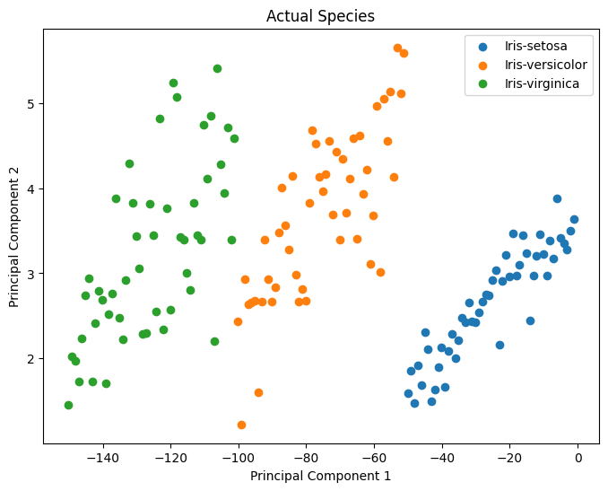
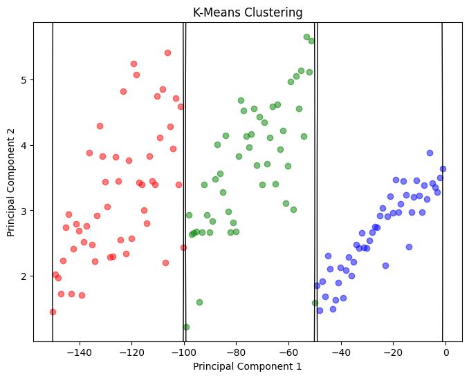
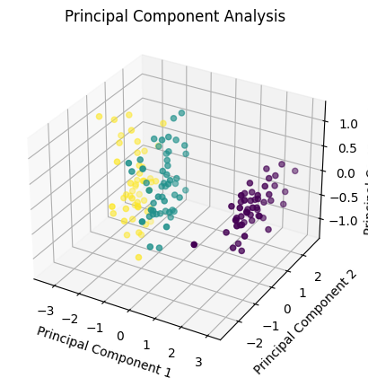
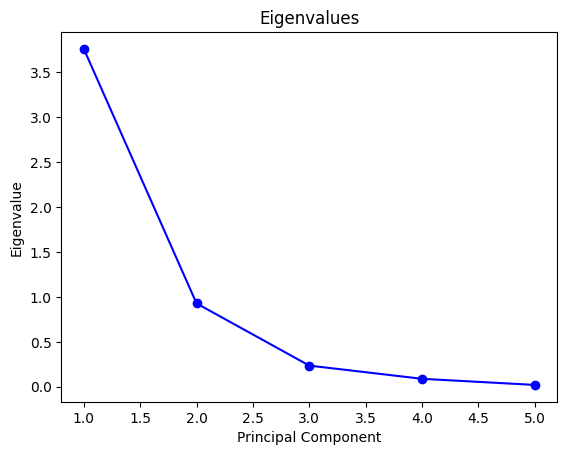

# GitHub Codespaces ♥️ Jupyter Notebooks
**Implement the K-Means Clustering and Principal Component Analysis algorithms from scratch in Python using Numpy and Pandas and Matplotlib for visualization.**
 

**K-Means Clustering**

 

 

**Principal Component Analysis**

 
